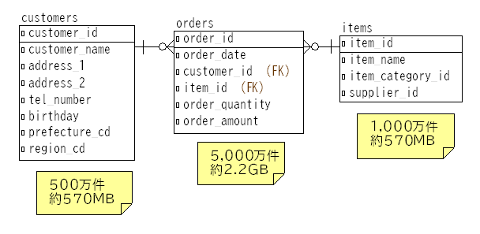

# 初級者向け SQL チューニング練習問題

このリポジトリは SQL を一通り学んだ初級者向けに、ごく簡単な SQL チューニングの練習問題を提供します。練習問題となる SQL 文だけではなくテーブルやデータを作成するスクリプトも含むため、実際の環境で動かながらチューニングを体験することができます。

- 対象の DBMS は Oracle です。
- テーブルやデータの準備スクリプトは Linux（Docker/Podman 含む）で動作します。
- 練習問題はインデックスの作成や簡単な SQL 文の修正など初歩的な方法を想定しています。
- 主に OLPT システムで発生しやすい課題を題材にしています。DWH システム向けのチューニングは対象外です。

テーブル構造やチューニング対象の SQL 文は意図的に非常にシンプルにしてあります。そのため、適当に試行錯誤することで速くすることができるかもしれませんが、実行計画の取得の方法やその解釈、遅い原因の特定などチューニングに必要なプロセスを経験することを意識して取り組んでもらえればと思います。

## 1. ファイル構成

- sql-tuning-for-beginner：トップディレクトリ
  - README.md：このファイル
  - scripts：テーブルやデータを準備するスクリプトを含むディレクトリ
  - questions：練習問題となる SQL 文を含むディレクトリ
    - Question*.sql：練習問題の SQL 文
  - notes：練習問題の補足説明を含むディレクトリ（まずは一度練習問題に取り組んでから読んでください）
    - Note*.md：各練習問題の補足説明

練習問題の解答例は含みません。

## 2. 環境準備

```scripts/setup/prepare_env.sh``` を実行することで練習問題で用いるテーブルやデータを作成することができます。

ただし、以下の前提条件・推奨事項があります。

- Linux 上の Oracle Database 23ai Free が前提になります。
- Oracle Linux 9、メモリ 4GB、ディスク容量 50GB の環境で動くことは確認済みです。
- OracleDB のローカルにスクリプトを配置して実行することを想定しているため、Amazon RDS for Oracle や Oracle Autonomous Database などローカルに接続できない環境では実行できません。
- スクリプト実行途中で初期化パラメーターの変更やインスタンス再起動を行うため、専用の環境を準備することが好ましいです。
  - 変更される初期化パラメターの内容について知りたい場合は、```scripts/setup/subscripts/02_create_user.sh``` を確認してください。
- 実システムに比べるとデータ量は小さいです（ユーザーデータはインデックス含めて 5GB 以下）。そのためチューニングによる SQL 文実行時間の短縮を実感しやすくするために、SSD ではなくハードディスク上にデータを保存することをお勧めします。


テーブルやデータの作成方法は以下の２パターンがあります。手元に OracleDB の環境がなければ後者が楽だと思います。
- 自分で構築した OracleDB 上に作成する（2.1. を参照）
- Docker/Podman を利用し OracleDB コンテナを作成する（2.2. を参照）

準備が完了すると sqltune という名前の DB ユーザー（パスワード：Passw0rd）が作成されます。この DB ユーザーには SELECT_CATALOG_ROLE や ALTER SESSION / SYSTEM 権限が付与されています。

### 2.1. 自分で構築した OracleDB 上に作成する

以下の手順を OS ユーザー oracle（もしくは SYSDBA に OS 認証で接続できるユーザー）で実行してください。

まずこのリポジトリをダウンロードします。

```bash
git clone https://github.com/abe-masanori/sql-tuning-for-beginner.git
cd sql-tuning-for-beginner
```

次に ```scripts/setup/prepare_env.sh``` の以下の部分を自分の環境に合わせて編集してください。OracleDB 23ai Free を RPM でインストール＆ DB 構築していれば編集する必要はありません。

```bash
export ORACLE_SID=FREE
export PDB_NAME=FREEPDB1
export ORACLE_HOME=/opt/oracle/product/23ai/dbhomeFree
export NLS_LANG=Japanese_Japan.AL32UTF8
```

最後に環境準備スクリプトを実行します。
```bash
cd scripts/setup
./prepare_env.sh
```

10-20分程度で完了します。以下のメッセージが表示されたら正しくテーブルとデータが作成されています。

```
**********************************
環境準備が完了しました
**********************************
```

以下のコマンドでテーブルやデータを含むスキーマに接続してください。

```bash
sqlplus sqltune/Passw0rd@localhost:1521/freepdb1
```

### 2.2. Docker/Podman を利用し OracleDB コンテナを作成する

Docker もしくは Podman がインストール済みで有効になっていることを前提とします。ホスト上で以下の手順を実行してください。

まずこのリポジトリをダウンロードします。

```bash
git clone https://github.com/abe-masanori/sql-tuning-for-beginner.git
cd sql-tuning-for-beginner
```

次に以下を実行してディレクトリ作成と所有者変更を行います。

```bash
mkdir oradata
sudo chown -R 54321:54321 oradata
sudo chown -R 54321:54321 scripts
```

最後に OracleDB コンテナを作成・実行します（```mydb```　には任意のコンテナ名、```*******``` には SYS/SYSTEM ユーザーに設定するパスワードを指定してください）。

- Docker の場合

```bash
sudo docker run -d --name mydb \
    -p 1521:1521 \
    -e ORACLE_PWD=******* \
    -v `pwd`/oradata:/opt/oracle/oradata \
    -v `pwd`/scripts/setup:/opt/oracle/scripts/setup \
    container-registry.oracle.com/database/free:latest
```

- Podman の場合（ボリュームマウントに ```Z``` オプションが必要）

```bash
sudo podman run -d --name mydb \
    -p 1521:1521 \
    -e ORACLE_PWD=******* \
    -v `pwd`/oradata:/opt/oracle/oradata:Z \
    -v `pwd`/scripts/setup:/opt/oracle/scripts/setup:Z \
    container-registry.oracle.com/database/free:latest
```

上のコマンドを実行後に ```sudo docker logs -f <コンテナID>```（Docker の場合）もしくは ```sudo docker logs -f <コンテナID>```（Podman の場合）でログを確認し、以下のメッセージが表示されたら正しくテーブルとデータが作成されています。

```
**********************************
環境準備が完了しました
**********************************
```

コンテナに ```docker/podman exec ...``` で接続後に SQL*Plus で DB に接続することもできますが、外部から SQL Developer などの Oracle クライアントツールを使って接続する方が楽だと思います。以下に接続情報を示します。

- ホスト名：（Docker/Podmanを動作させているホストサーバーのホスト名またはIPアドレス）
- ポート番号：1521
- サービス名：FREEPDB1
- ユーザー名：sqltune
- パスワード：Passw0rd

## 3. 練習問題に取り組むにあたり

### 3.1. 対象となるテーブル



### 3.2. チューニングを行う上での一般的な注意点

実測⇒原因推定⇒チューニング案検討⇒仮適用＆実測のプロセスを意識して取り組んでください。

- 無闇にチューニング案を試すのではなく、まず問題の SQL 文を実行して実行計画を取得してください。
  - 実行計画を取得する方法は複数ありますが、オペレーション（実行計画の１ステップ）ごとの実際の行数や論理/物理読み込み量などが取得できる方法がお勧めです。
  - 実行計画の取得方法の中にはオプティマイザーが見積もった（予測した）行数などのみを表示する方法もありますが、「実際の」行数などが確認できる方法を利用してください。
- 取得した実行計画を確認して、なぜ遅くなっているのか、どうなったら速くなるのかの仮説を立ててください。
  - 実行計画を解釈する上で以下の内容は前提知識として必要になります。事前に学習しておいてください。
    - テーブルやインデックス（特に B-tree）の内部構造
    - 実行計画におけるオペレーションの処理内容
    - 実行計画に含まれる統計量の意味（実行回数、行数、論理/物理読み込み回数など）
- 仮説に基づいてチューニング案を検討し、実際に適用してください。
  - 練習問題はシンプルなのですべての問題で可能ではないですが、できれば複数のチューニング案を考えてみてください。
  - 複数の案を検討し試すことで、今回の練習問題では改善しなかったとしても、チューニング手法に関する知識の幅を広げるができると思います。
- チューニング案を適用後に再度実行計画を取得し、想定通りの計画になっているか確認してください。
  - 実行時間が短くなっただけでは、データがたまたまキャッシュに乗っていて速かった、作成したインデックスがすべて使われていなかった（無駄なインデクスを作成していた）などを見落とす可能性があります。
  - 想定通りの計画になっていない場合、その理由と是非を判断し、非である場合は対策を検討・適用してください。
- インデックスを作成した場合、インデックスのオプティマイザー統計情報を取得してください。
- 試行した内容は記録に残してください。

### 3.3. 練習問題に取り組む上での注意点

- チューニング方法としてインデックスの作成か SQL 文の修正に限定します。
  - 実際のチューニングでは、テーブル構造の見直しや事前に処理した結果を永続化するなどさまざまな方法が採用されますが、練習問題でそれを許すと際限がないため。
- インデックスを作成する場合は、最小限のものに限ってください。
  - 練習問題では１つの SQL 文にのみ注目しますが、実際のシステム開発においては他の更新処理への影響も考慮する必要があるため、無闇にインデックスを作成せず最低限必要なインデックスを特定してください。
- 1つの練習問題を解き終えて次に行くときには、作成したインデックスは削除してください。
- SQL 文を書き換える場合は、クエリ結果が同じになるように書き換えてください。
- 実行する前に ```alter system flush shared_pool``` と ```alter system flush buffer_cache``` を実行してキャッシュを削除してください。
  - キャッシュ有無による性能差を減らすため。 
- SQL 文にはリテラル値で条件が記載されていますが、ひとまず記載された値に対して実行時間が短くなるように考えてください。
  - 練習問題中のリテラル値はヒットする件数などを考慮して指定されています。

### 3.4. 今後追加したい問題（備忘録）

- カーディナリティーが低いカラムの扱い
- 相関問い合わせ
- WITH 句を用いたチューニング
- インデックスの ASC/DESC
- OR 条件
- ロック
- Join Elimination